# Building my DevOps Portfolio 🚀

## Project 9: Github Actions for CICD.
One of the benefits of working at EY is Udemy for Business. I enrolled in the DevOps Projects | 20 Real-Time DevOps Projects course to enhance my DevOps portfolio and I’m sharing this process for educational purposes.

### Marketplace Actions used: 
🖤Checkout
🖤Sonar scanner
🖤Sonar Qualitygate
🖤AWS ECR
🖤AWS ECS Deploy task definition

### Steps
Github Setup 
⏭️Fork git repo
⏭️SSH Login
⏭️Integrate with VSCode

Test code
⏭️Workflow & Job
⏭️Maven & Checkstyle
⏭️Sonar scanner
⏭️Sonar cloud

Build & Upload Image
⏭️Job in workflow
⏭️Build Docker image
⏭️Upload AWS ECR

Deploy to ECS
⏭️Job in workflow
⏭️Deploy ECS Task definition
⏭️RDS for app container

## Github action CICD implementation
- Diagram
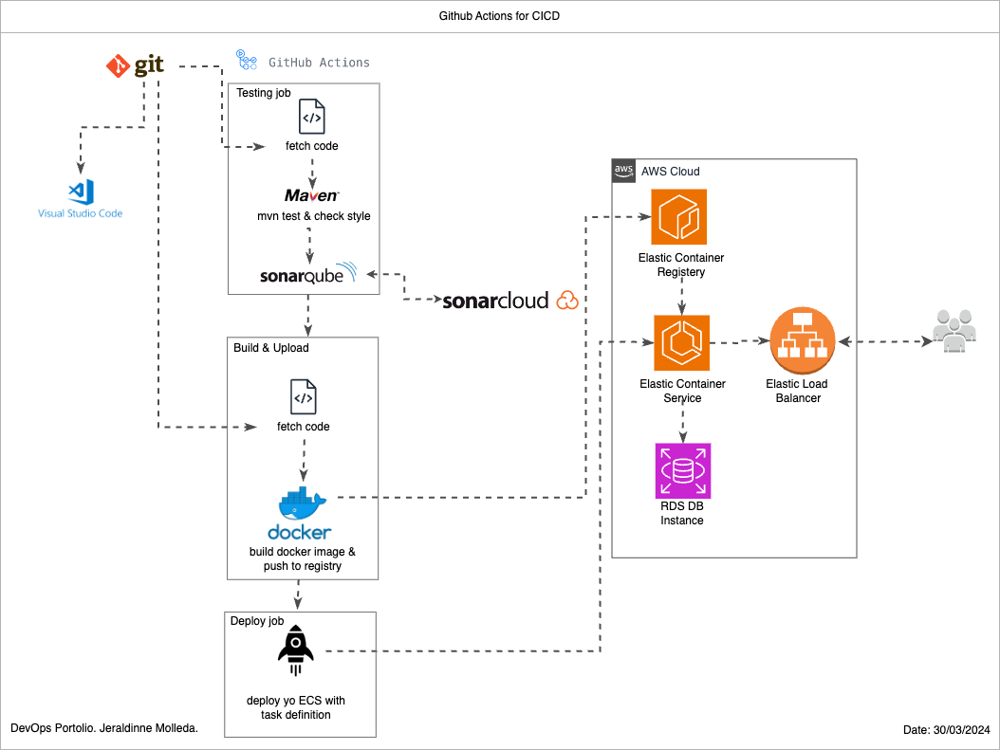
- CICD Github actions
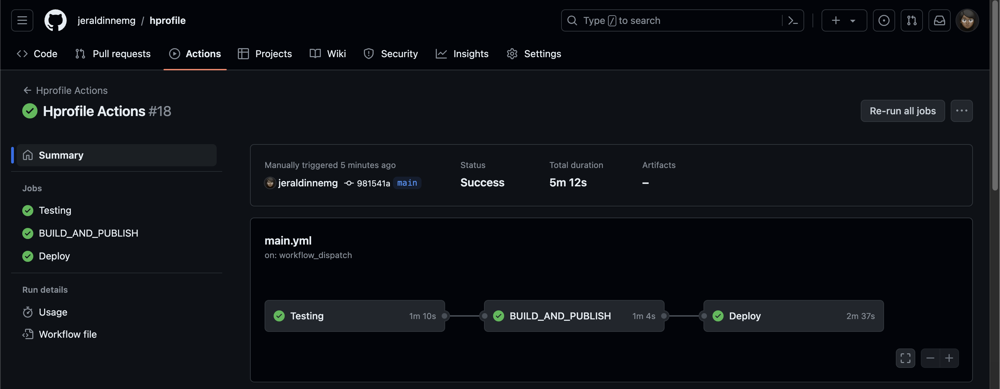
- Testing job
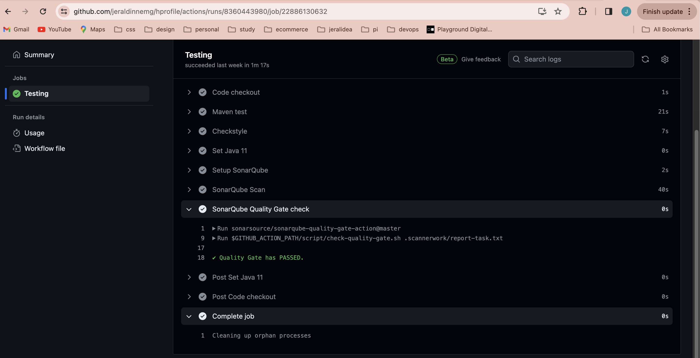
- Sonar cloud
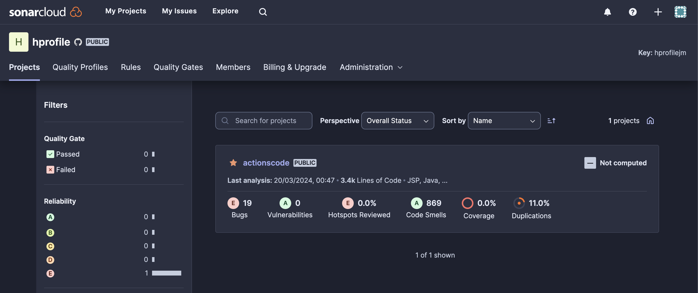
- Rule quality gate
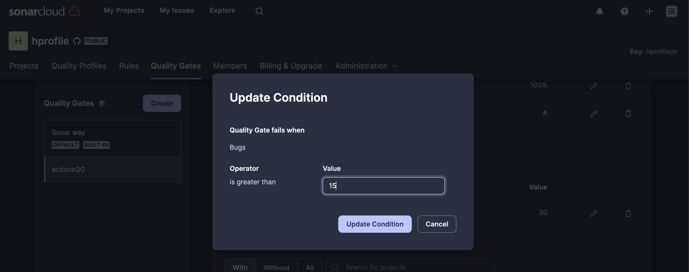
- Testing quality gate failed with the rule set
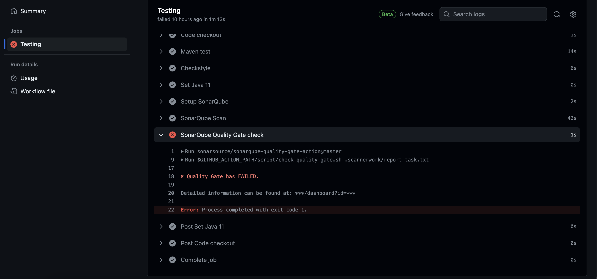
- AWS ECR

- AWS ECS Service
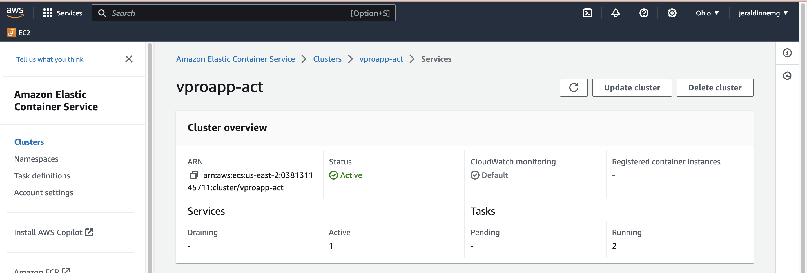
- Load Balancer
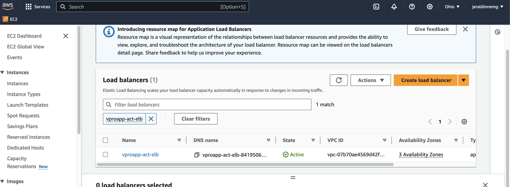
- Target group healthy
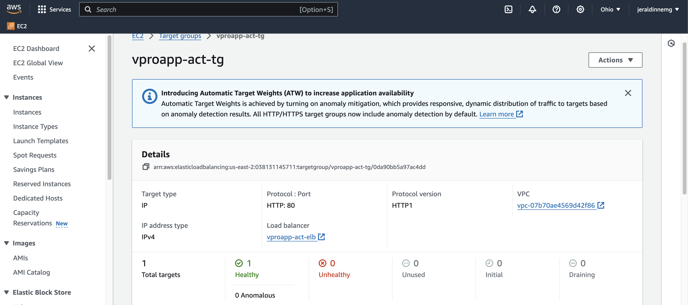
- Marketplace Githubactions used
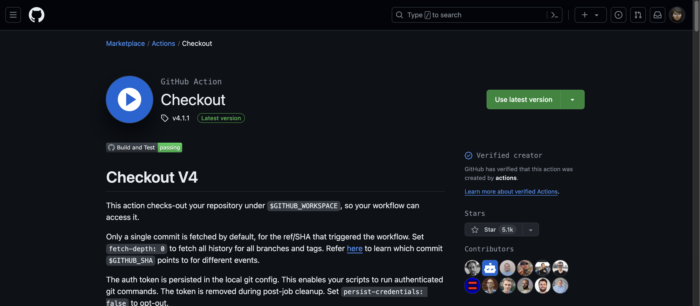
- Marketplace Githubactions used
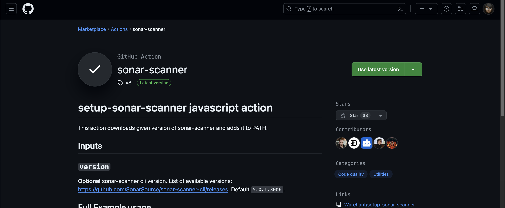
- Marketplace Githubactions used
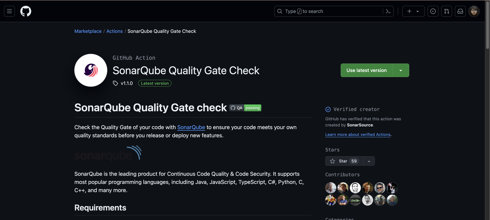
- Marketplace Githubactions used
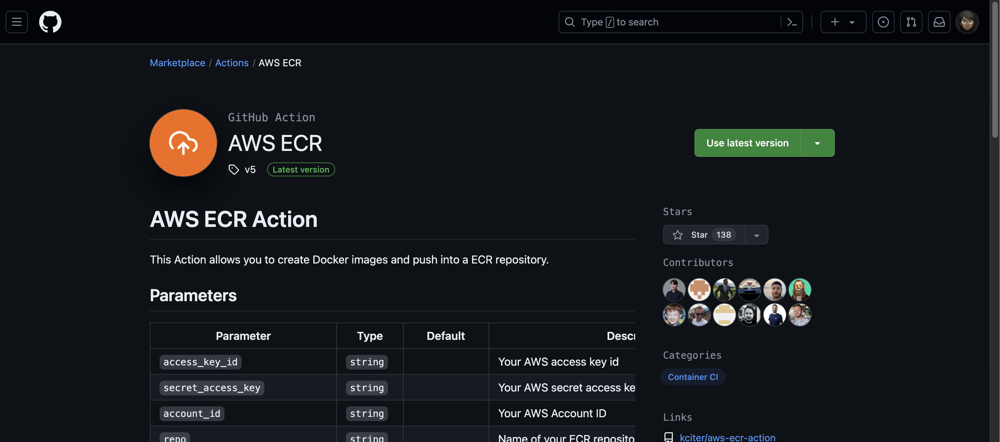
- Marketplace Githubactions used
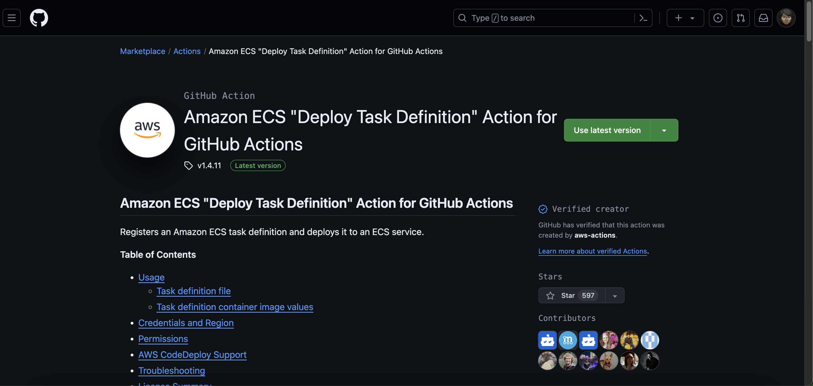

# Prerequisites
#####
- JDK 11
- Maven 3
- MySQL 8 

# Technologies 
- Spring MVC
- Spring Security
- Spring Data JPA
- Maven
- JSP
- MySQL
# Database
Here,we used Mysql DB 
MSQL DB Installation Steps for Linux ubuntu 14.04:
- $ sudo apt-get update
- $ sudo apt-get install mysql-server

Then look for the file :
- /src/main/resources/db_backup.sql
- db_backup.sql file is a mysql dump file.we have to import this dump to mysql db server
- > mysql -u <user_name> -p accounts < db_backup.sql
#testing
